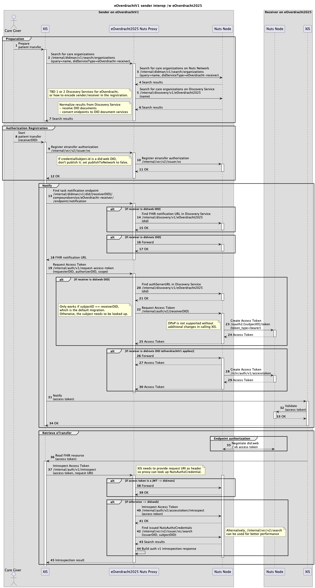

# eOverdracht2025 Interop Proxy

This is an attempt to let implementors of eOverdrachtV1 transfer patients to implementors of eOverdracht2025, with;

- minimal changes to the sender's existing integration with the Nuts node
- no changes to the receiver's integration

It builds on:
- [eOverdrachtV1](https://nuts-foundation.gitbook.io/bolts/eoverdracht/leveranciersspecificatie#id-5.3-ophalen-overdrachtsbericht)
- [eOverdracht2025](https://wiki.nuts.nl/books/hackathons-drafts/page/nuts-application-eoverdracht-20)

## Limitations

- It only works for an eOverdrachtV1 implementation transferring a patient to an eOverdracht2025 implementation, not vice versa.
- It requires both sender and receiver to run a v6 Nuts node, configured for use of `did:web`.
- It requires the sender to provide the requested resource URI in the token introspection invocation.

## Architecture

Interoperability is achieved by introducing an opaque, smart proxy between the sender's XIS and its Nuts node.
This proxy invokes different Nuts node APIs depending on whether the receiver of the patient transfer uses `did:nuts` (eOverdrachtV1) or `did:web` (eOverdracht2025).

### Design

